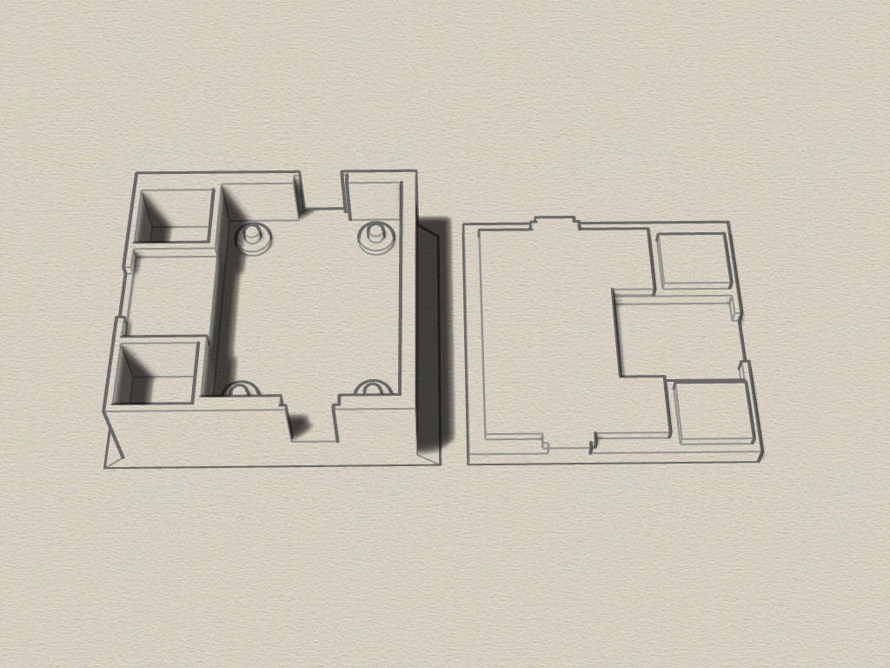
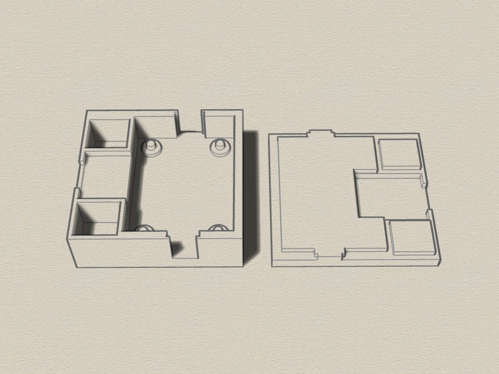
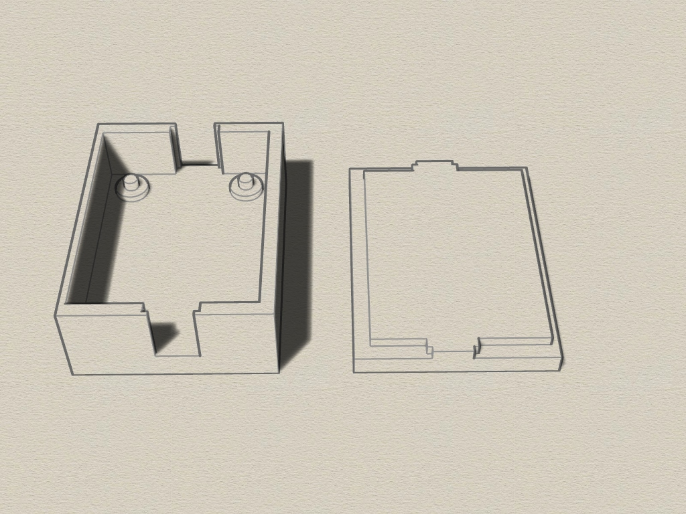

# LNA-Wideband-Amplifier-Enclosure
3D printable enclosure for cheap LNA-Wideband-Amplifier. Created with Rhino 6.

There are two Versions of the Case. The second one has an additional Micro-USB Port for powering with 5 V from USB Port. 

Requirements:
* 3D printer 
* Filament of your choice

## View
 
 
 
